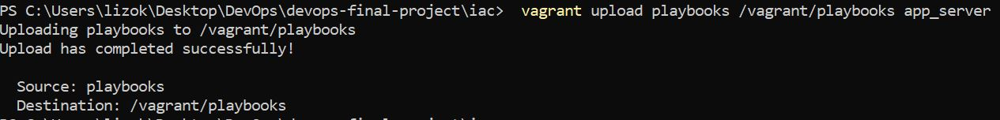
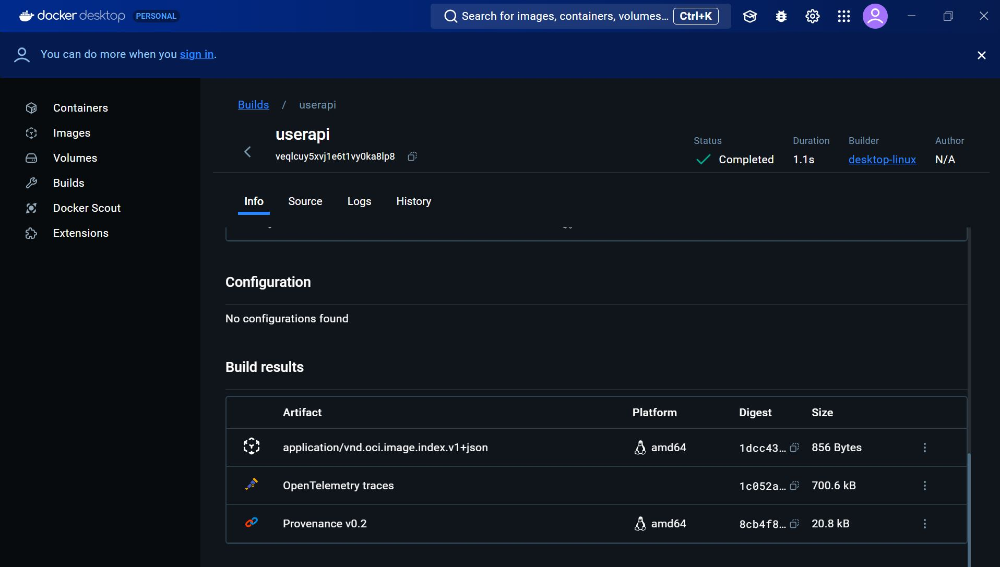
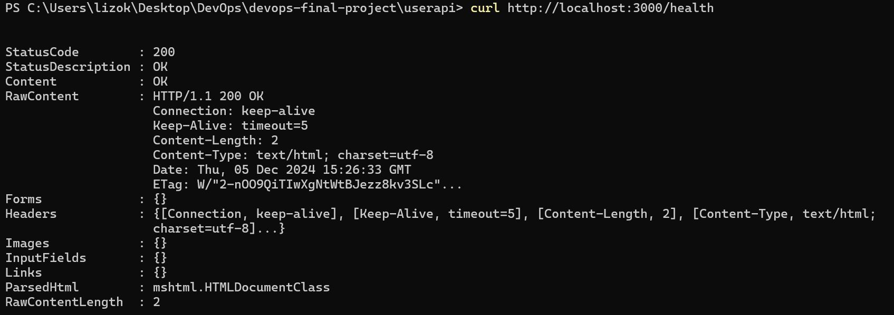

# DevOps Final Project
_Author: Danilina Elizaveta_

## Introduction

This document outlines a comprehensive project encompassing the creation of a simple web application with CRUD functionality, its deployment using CI/CD, infrastructure-as-code provisioning, Dockerization, container orchestration with Docker Compose and Kubernetes, service mesh implementation with Istio, and finally, monitoring with Prometheus and Grafana. The project aims to demonstrate a complete DevOps workflow, from development and testing to deployment, orchestration, and monitoring of a containerized application. 


## Project description

This part will be describing the key principles of each step of the project and how to reproduce it.

### Web application

The web application was created on NodeJS language with Redis database. Web application consist several tests of different levels.

**Key features of the application:**
- Create user
- Get all users, get one user by username
- Update user
- Delete user
- Unit, API, configuration and connection tests.
- Health check endpoint (/health, /liveness, /readiness)
- Swagger UI

**Steps to start an application**:
1. Download project files
2. Install Redis database
> - Windows: https://redis.com/ebook/appendix-a/a-3-installing-on-windows/a-3-2-installing-redis-on-window/
> - MacOS: brew install redis or https://redis.io/topics/quickstart
> - Linux or MacOS: https://redis.io/topics/quickstart
3. Install [Node.js](https://git-scm.com/book/en/v2/Getting-Started-Installing-Git)
4. Install an IDE or a text editor, for example [VS Code](https://code.visualstudio.com/)
5. Using CLI bash commands in the terminal (Terminal or Git Bash) navigate to the directory where the project folder will be stored.
  ```
  cd ~/path/to/your-root-project-directory
  ```
  
6. Navigate to the `userapi` folder
  ```
  cd userapi
  ```
  
7. Download project dependencies
  ```
  npm install
  ```
  
8. Run NPM script to test application
  ```
  npm test
  ```
  
9. Run NPM script to run the application
  ```
  npm start
  ```
   After that the application will be available by this link: [http://localhost:3000](http://localhost:3000).\
   Health check will be available by adding `/health` or `/liveness` or `/readiness` in the end of the link.\
   Swagger UI will be available by adding `/api-docs`.\
   Data of users will be available by adding `/user`.

***Screenshots***
1. Application tests\
   \
   

2. Running application\
   \
   

3. Main page\
   \
   
   
5. `/user` page (user's data)\
   \
   
   
7. Health check\
   \
   
    \
   
    \
   
   
9. Swagger UI\
   \
   


### CI/CD pipeline
CI/CD pipeline was made on [GitHub Actions](https://docs.github.com/en/actions/about-github-actions/understanding-github-actions). CD part added to code but not working due to [Heroku’s](https://www.heroku.com/) paid services. Secrets of the Heroku account also added in the repository secrets.

The Continuous Integration part runs unit tests and starts the application for 30 seconds. A Redis container is spun up as a service for the tests to use. The Continuous Delivery stage deploys the application to Heroku using a Heroku API key. 

Use GitHub Actions to start a workflow.

***Screenshots***
1. CI/CD pipeline result\
   \
   

### IaC approach

A virtual environment was configured on Linux distribution and provisioned with [Ansible](https://docs.ansible.com/ansible/latest/getting_started/introduction.html), which includes installing and running:
- language runtime
- database
- application
- health check of the application

Furthermore, [Apache2](https://httpd.apache.org/) is loaded to the VM to run the application

**Steps to run the VM and check the health of the application**
1. Install [VirtualBox](https://www.virtualbox.org/wiki/Downloads).
2. Install [Vagrant](https://www.vagrantup.com/downloads.html).
3. Create a virtual machine
  ```
  vagrant up
  ```
4. Download the `centos/7` Vagrant box for the Virtualbox provider, run:
  ```
  vagrant box add centos/7
  ```
  It will output:
  ```
  ==> box: Loading metadata for box 'centos/7'
     box: URL: https://vagrantcloud.com/centos/7
  This box can work with multiple providers! The providers that it can work with are listed below. Please review the list and   choose
  the provider you will be working with.
  
  1) hyperv
  2) libvirt
  3) virtualbox
  4) vmware_desktop
  
  Enter your choice: 3
  ```
5. Go to the /iac directory
  ```
  cd iac
  ```
6. Run command
  ```
  vagrant up
  ```
7. Upload playbooks
  ```
  vagrant upload playbooks /vagrant/playbooks app_server
  ```
8. Run provisioning script
  ```
  vagrant provision
  ```
9. Run vagrant
  ```
  vagrant ssh
  ```
10. Run ansible-playbooks. It will also run the health checks.
  ```
  ansible-playbook -vvvv /vagrant/playbook/run
  ```
11. To check separately the connection to the health points
  ```
  curl http://localhost:3000/health
  curl http://localhost:3000/liveness
  curl http://localhost:3000/readiness
  ```

***Screenshots***
1. Virtual box\
   \
   
   
2. Vagrant status\
   \
   

3. Upload Playbooks\
   \
   

4. Vargant ssh result\
   \
   
5. Result of the `ansible-playbook`\
   \
   
   \
   
   \
   
   
   \
   
6. Result of the `curl`\
   \
   
   

### Docker image and container orchestration using Docker Compose

Docker image and docker-compose.yml was created.

**Steps to create the Docker image**
1. Install [Docker Desktop](https://www.docker.com/get-started)
2. Start Docker
  ```
  docker up
  ```
3. Build Docker
  ```
  docker compose
  ```
5. Push to the Docker
  ```
  docker push lizadan/userapi:latest
  ```
6. Check health of the app
  ```
  curl http://localhost:3000/health
  curl http://localhost:3000/liveness
  curl http://localhost:3000/readiness
  ```
***Screenshots***
1. DockerHub\
  \
  
  \
  
  \
  
  \
  
   
2. Docker logs\
  \
  

3. Check health\
  \
  
  \
  
  \
  

### Make docker orchestration using Kubernetes
Create [Kubernetes](https://kubernetes.io/) Manifest YAML files:
- deployments
- services
- persistent volume and persistent volume claim

**Steps to make docker orchestration using Kubernetes**
1. Install [Minikube](https://kubernetes.io/docs/tasks/tools/install-minikube/).
2. Start Minikube with:
  ```
  minikube start
  ```
Verify that everything is OK with:
  ```
  minikube status
  ```
3. Apply all files in the Kubernetes folder
  ```
  kubectl apply -f k8s/
  ```
4. Check Pods
  ```
  kubectl get pods
  ```
5. Check the userapi deployment name
  ```
  kubectl get deployment
  ```
6. Check health
  ```
  kubectl exec [userapi-deployment-name] --wget -qO- http://localhost:3000/health
  kubectl exec [userapi-deployment-name] --wget -qO- http://localhost:3000/liveness
  kubectl exec [userapi-deployment-name] --wget -qO- http://localhost:3000/readiness
  ```
***Screenshots***
1. VirtualBox Minikube\
   \
   
2. Minikube status\
   \
   
3. Apply all files\
   \
   
4. Pod Status\
   \
   
5. Health Check\
   \
   
   
### Make a service mesh using Istio
Deploy your application using Istio and create configuration:
- route requests between 2 different versions of the app
- traffic shifting between 2 different versions of the app (80%/20%)

**Steps to Make a service mesh**
1. Install [Istio](https://istio.io/docs/setup/getting-started/)
2. Start minikube
  ```
  minikube start
  ```
3. Build 2 versions with different Dockerfile
  ```
  docker build -t lizadan/userapi:v1 -f ./istio/userapi-v1/Dockerfile .
  docker build -t lizadan/userapi:v2 -f ./istio/userapi-v2/Dockerfile .
  ```
3. Apply all the files
  ```
  kubectl apply -f istio/
  ```
4. Check Pods
  ```
  kubectl get pods
  ```
5. Try to connect to the app
  ```
  curl http://userapi.default.svc.cluster.local/health
  ```

***Screenshots***
1. Pods running\
   \
   
   
### Implement Monitoring
Set up monitoring with Prometheus:
- Prometheus should contact the application (eg. health check endpoint) and pull its status
  
Set up monitoring with Grafana:
- Link it to the Prometheus server and display the monitored applications
- Change information depends on the selected pod (add pod value in the `variables`)
- Create alerts and trigger them by shutting down your applications.

**Steps to implement monitoring**
1. Install [Prometheus](https://istio.io/latest/docs/ops/integrations/prometheus/)

2. Install [Grafana](https://istio.io/latest/docs/ops/integrations/grafana/)
3. To start Grafana and Prometheus it is needed to start Minikube and open connection
  ```
  minikube start
  minikube tunnel
  ```
4. In different Powershell run command
  ```
  kubectl port-forward svc/prometheus-operated 9090:9090 -n prometheus
  ```
5. To open prometheus open the `http://localhost:9090` link
6. To run grafana
  ```
  minikube service grafana
  ```
The login and password for Grafana is `admin`

***Screenshots***
1. App health\
  \
   
   
2. Grafana\
  \
   
  \
   
3. Prometheus\
  \
   
  \
   
  \
   
  \
   
   
4. Dashboard\
  \
   
  \
   
  \
   
  \
   
  \
   
  \
   
  \
   
  \
   
  \
   
   
8. Alerts\
  \
   
  \
   
  \
   
  \
   
  \
   
9. Trigger\
  \
   
  \
   
  \
   
  \
   
10. Change pod value\
  \
   
  \
   
  \
   

   
    
